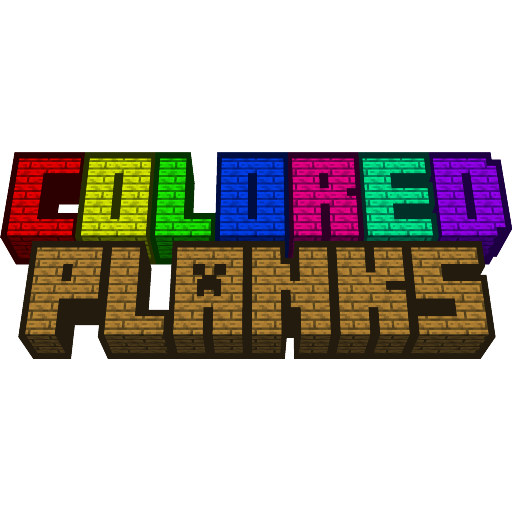

<table  align="center">
	<tbody>
		<tr>
			<td width="280px" style="text-align: center;"></td>		
			<td>
				<h2 align="left">Colored Planks</h2>
				
<b>for Minecraft Beta 1.7.3</b>

				
				
Simple mod that adds colored planks and blocks from them for Minecraft beta 1.7.3 (for StAPI)

			</td>		
		</tr>
	</tbody>
</table>

**Available block types:**
- Full blocks
- Stairs
- Slabs
- Fences
- Pressure plates
- Buttons